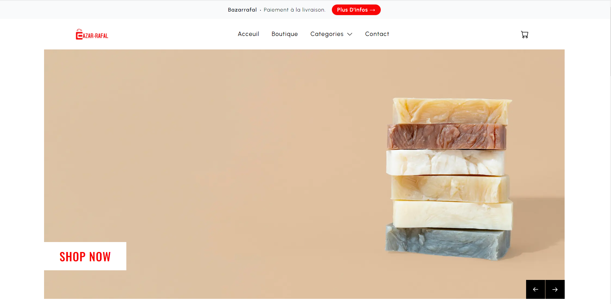
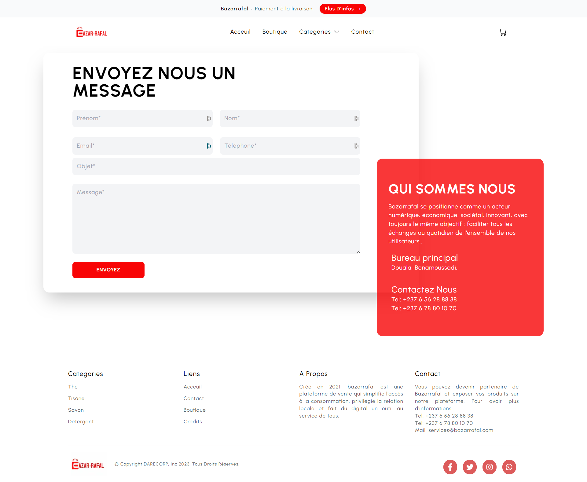

## Ecommerce  website of bazarrafal society with Next.js ,Tailwindcss and SendGrid

Frontend part of the ecommerce app for bazarrafal write in Next.js - Integrated with SendGrid's API for sending emails.

## Tech Stack

- [Next.js](https://nextjs.org) for creating the pages and components
- [Tailwindcss](https://tailwindcss.com) for styling the components
- [SendGrid](https://sendgrid.com) for sending emails using their APIs
- [Redux](https://redux-toolkit.js.org/) to persist items in my cart

## Environment Variables

Please not that we are using the API keys and the keys are sensitive. Which means that we should always store secret or API keys in environment variables. As we already have .env.local for our local environment, The hosting provider needs to know about the API keys too.

We have in this project three environment variables:
- NEXT_PUBLIC_STRAPI_API_TOKEN
- NEXT_PUBLIC_UPLOAD_URL
- SENDGRID_API_KEY

# License

This code source is not free of use. It is the under the right of Darecorp Inc.